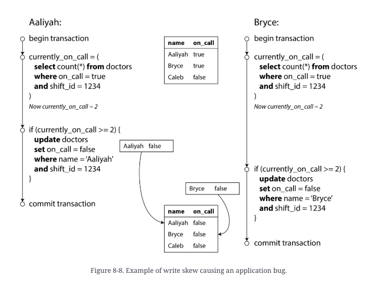

## ACID

Atomicity(specifically *abortability*) - if the writes are grouped together intro an atomic transaction,
and the transaction cannot be completed due to a fault, then database must discard
or undo any writes it has made so far in that transaction. 
**User should not worry about partial failure.**

Consistency - after transaction database being in a "good state".(e.g. it doesn't violate
constraints)

Isolation - concurrently executing transactions are isolated from each other. Transaction A cannot see
data changed by transaction B if transaction B is still executing.
More classic database books call this serializability

Durability - once transaction committed successfully, any data it has written will not be forgotten, even
if there is a fault or crash.(of course if disk is destroyed, data will be lost)


Distributed databases like ScyllaDB provide light-weight transactions for single object update.

## Weak transaction isolation

Weak isolation means that transaction will have isolation if specific cases of events intersection(events are writes and reads of one or many records from different transactions).

### Anomalies

*Dirty read* - one transaction reads resulted update of another NOT committted transaction.

*Dirty write*:
Two transactions A and B can make two writes to different tables at the same id W1(first table) and W2(second table).

Dirty write is situation of events:
AW1
BW1
BW2(and commit)
AW2(and commit)

Resulting records:
BW1
AW2

The update AW1 is lost.


*Read skew*(or read timing anomaly) - 
In the process of transaction record, which it queries may have changed and committed from another transaction, which is not okay if several records have connection.

This skew is critical for making backups, analytic queries and integrity checks, transaction correctness.

### Isolation levels

#### *Read committed isolation*:
1. When reading from the database, transaction will see only committed data(no dirty reads)
2. When writing to the database, transaction will only overwrite data that has been committed(no dirty writes)
However, *read committed* does not prevent race condition on read-write counters.(Picture read_write_counters.png)

Preventing dirty writes often implemented as row-based locks. Only one transaction can acquire lock at a time(which may cause deadlock or error).
Dirty reads is prevented by using latest committed version of row(which doesn't have lock).

When isolation only prevents dirty-writes it's called *Read uncommitted isolation*


#### *Snapshot isolation or Repeatable Read(named by postgres)*

Goal is to prevent *read skew*. Idea is that transaction reads from *consistent snapshot* of database.

**MVCC(multi-version concurrency control) as implementation**

Key principle - readers never block writers, and writers never block readers.

To make it possible database need to keep several different committed versions of a row, because
various in-progress transactions may need to see the state of database in a different point of time.

In PostgreSQL:
1. When transaction is started it receives txid(always increasing integer ID)
2. When transaction writes anything to the db, the data it writes tagged with the transaction ID of the writer.
3. Each row has inserted_by_txid and deleted_by_txid(initially empty). 

Postgres storage is append-only so old rows deleted with autovacuum process when it's certain that no transaction
can any longer access the deleted or overwritten data.

> What if tx 1 started and tx 2 started too, and tx2 reads data and then tx1 updates data and tx2 reads data again. 
What happens then?

Well, to prevent this there are visibility rules for transactions:
1. At the beginning of current transaction - it receives list of currently active transactions and ignores data written by them
2. Also transaction ignores all data with txid bigger than it's own
3. The rollbacked transactions data ignored too
4. Any other data is visible for transaction


#### **Preventing lost updates**

The problem with counters example is the "read and modify" approach, many databases support atomic operations.
Another approach is to exclusively lock object before "read and modify" approach, so any other transaction cannot infer.

Another cool way is when database itself provides **automatically detecting lost updates** has occurred and aborts the offending transaction. Postgres does it with repeatable read. MySQL doesn't detect lost updates in repeatable reads.

Databases without transactions provide "compare and set" conditional writes, which is atomic "compare and swap"
The approach of "compare and swap" with version checking called *optimistic locking*, PostgreSQL uses *pessimistic locking*, which actually locks the record

#### **Write skew and phantoms**


While lost updates is about non-commutative update operations on one record. Write skew is when transactions read the same objects and then update some of those objects(different transactions may update different objects).

When transactions update one object - possible anomalies are: *dirty write or lost update*.

Write skew doesn't automatically detected in Postgres repeatable read.

Possible solution is to lock all rows returned by query:
```sql
BEGIN TRANSACTION;

SELECT * FROM doctors
  WHERE on_call = true
  AND shift_id = 1234 FOR UPDATE;

UPDATE doctors
  SET on_call = false
  WHERE name = 'Aaliyah'
  AND shift_id = 1234;

COMMIT;
```

`FOR SHARE` may be used to make a read-lock.

##### Phantoms causing write skew

1. A `SELECT` query checks whether some requirement is satisfied
2. Depending on result application decides to continue
3. It makes write and commits, the effect of write changes the precondition. Another concurrent transaction would not see committed write and decision step would be skewed.

Locking rows from `SELECT` statement may help, **however** the absence of record cannot be locked. 
This effect, where a write in one transaction changes the result of a search query in another transaction, is called a phantom.

Possible solution is to create a table with artificial objects to attach locks(in a booking case - table with time slots), when transactions would have **materializing conflict**.

<br/>

#### Serializability

It's great, but not anybody uses it. Implementations:

**Actual serial execution**

Redis, VoltDB, Datomic uses this approach.

Faster than may seem, because often data is cached in memory.

Systems with single-threaded serial transaction processing don’t allow interactive multi-statement transactions because of dramatically large networking latency. 

Instead, the application must either limit itself to transactions containing a single statement, or submit the entire transaction code to the database ahead of time, as a *stored procedure*.

<br/>

**Two-phase locking(2PL, not confuse with two-phase commit)**

Used for serializable isolation level in MySQL, SQL Server

Several transactions are allowed to concurrently read the same object as long as nobody is writing to it. When anyone wants to write an object, exclusive lock is required:
1. If transaction A reads object and transaction B want to update it, transaction B must wait until A completed.
2. If transaction A writes an object and transaction B want to read the object, B must wait until A is completed.

Each object has *multi-reader single-writer lock*.

After a transaction has acquired the lock, it must continue to hold the lock until the end of the transaction

Downside of having so much locks - bad performance and common deadlocks.

*Prevented anomalies with two-phase locks:*
1. Dirty write/read
2. Write skew
3. Read skew
4. Lost updates
5. Write skew with phantoms

<br/>

### Real world example
> Flexcoin collapsed because of weak isolation bug - two transactions made SELECT balance as first statement
and then update it, in result - due to isolation level, balance get negative.

*X-ability*

**Serializability** - each transaction can pretend that it is the
only transaction running on the entire database. The database ensures that than all transactions are
complete - result is the same as if they had run serially or one after another, even if they have run
concurrently.
(Oracle is not serializable)

**Linearizability** - as soon as one client successfully completes a write, all clients reading from the database must be able to see the value just written.


**Single node transaction**

**Distributed transaction**


TODO:
- how to make distributed transaction - is it possible, if yes with which conditions?
- what is the future of transactions or it's just exist and doesn't need improvements?
