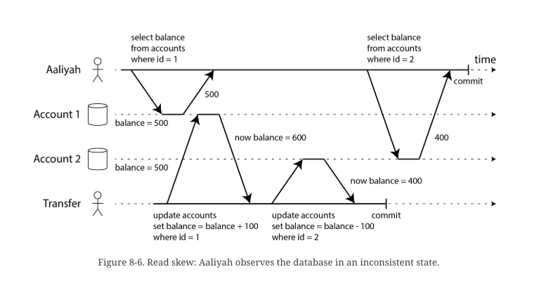

## ACID

Atomicity(specifically *abortability*) - if the writes are grouped together intro an atomic transaction,
and the transaction cannot be completed due to a fault, then database must discard
or undo any writes it has made so far in that transaction. 
**User should not worry about partial failure.**

Consistency - after transaction database being in a "good state".(e.g. it doesn't violate
constraints)

Isolation - concurrently executing transactions are isolated from each other. Transaction A cannot see
data changed by transaction B if transaction B is still executing.
More classic database books call this serializability

Durability - once transaction committed successfully, any data it has written will not be forgotten, even
if there is a fault or crash.(of course if disk is destroyed, data will be lost)

Distributed databases like ScyllaDB provide light-weight transactions for single object update.

## Weak transaction isolation

Weak isolation means that transaction will have isolation if specific cases of events intersection(events are writes and reads of one or many records from different transactions).

### Anomalies

*Dirty read* - one transaction reads resulted update of another NOT committted transaction.

*Dirty write*:
Two transactions A and B can make two writes to different tables at the same id W1(first table) and W2(second table).

Dirty write is situation of events:
AW1
BW1
BW2(and commit)
AW2(and commit)

Resulting records:
BW1
AW2

The update AW1 is lost.

*Read skew* - 

### Isolation levels

#### *Read committed isolation*:
1. When reading from the database, transaction will see only committed data(no dirty reads)
2. When writing to the database, transaction will only overwrite data that has been committed(no dirty writes)
However, *read committed* does not prevent race condition on read-write counters.(Picture read_write_counters.png)

Preventing dirty writes often implemented as row-based locks. Only one transaction can acquire lock at a time(which may cause deadlock or error).
Dirty reads is prevented by using latest committed version of row(which doesn't have lock).

When isolation only prevents dirty-writes it's called *Read uncommitted isolation*

#### *Snapshot isolation and Repeatable Read*

> Flexcoin collapsed because of weak isolation bug - two transactions made SELECT balance as first statement
and then update it, in result - due to isolation level, balance get negative.

*X-ability*

**Serializability** - each transaction can pretend that it is the
only transaction running on the entire database. The database ensures that than all transactions are
complete - result is the same as if they had run serially or one after another, even if they have run
concurrently.
(Oracle is not serializable)

**Linearizability** - as soon as one client successfully completes a write, all clients reading from the database must be able to see the value just written.

**Single node transaction**

**Distributed transaction**

TODO:
- what types of transaction guarantees exist
- which implemented in popular DBS like pg/mongo/scylla/olap?
- how it stored in disk
- how to make distributed transaction - is it possible, if yes with which conditions?
- what is the future of transactions or it's just exist and doesn't need improvements?
- what is MVCC?
